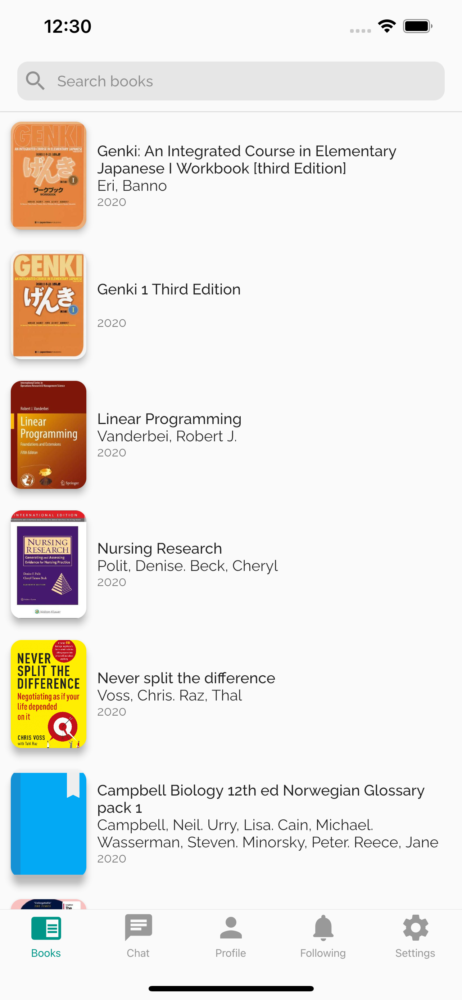
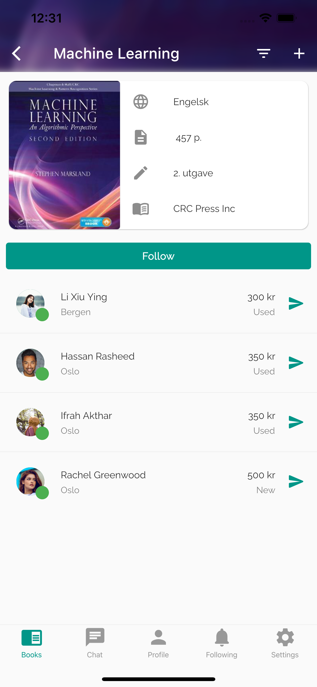
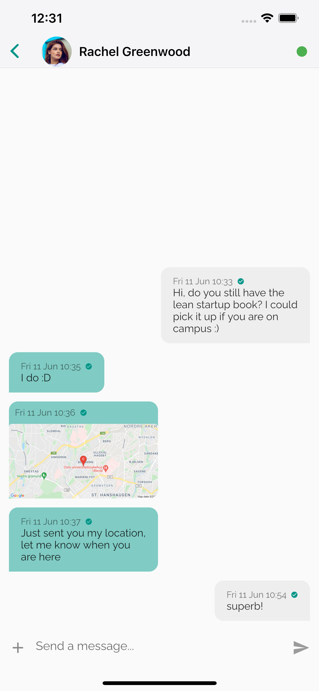

# leaf

[Privacy Policy](privacy.md)\
[Support](support.md)

A flutter project for buying and selling books, mainly campus curriculum socially. It uses a **MVVM** architecture achieved with the *provider* packages and *firebase* as the backend. All lists iclude **paging** with *ScrollNotification* and lazy loading with use of *ListView.builder* method. The code is now migrated to *Sound Null Safety*. Currently the project includes the following features:
* Authentication
* Chat (incl. images and location)
* Profile
* Deals filtering
* Book search
* Notifications
* Presence system

### Screenshots

  

### Usage

To install the application locally you first need to clone this repository, then run

	flutter pub get

to install the dependencies, the project still need to be connected with the backend i.e. *firebase*. This can be done by installing the necessary files services files for android and ios from firebase.google.com. Ideally run the project from VSCode or connect to a device and run:

	flutter run
